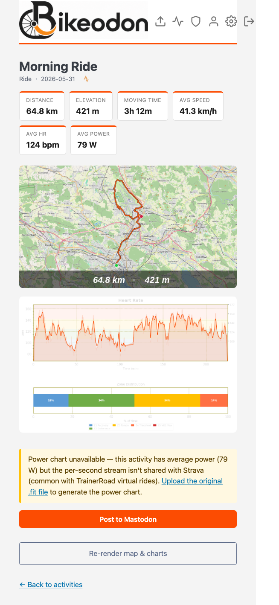
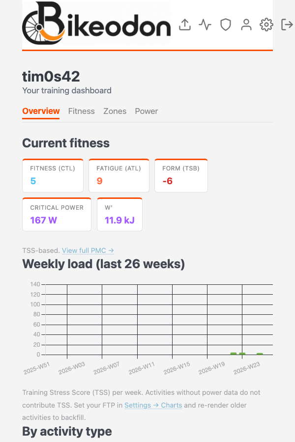
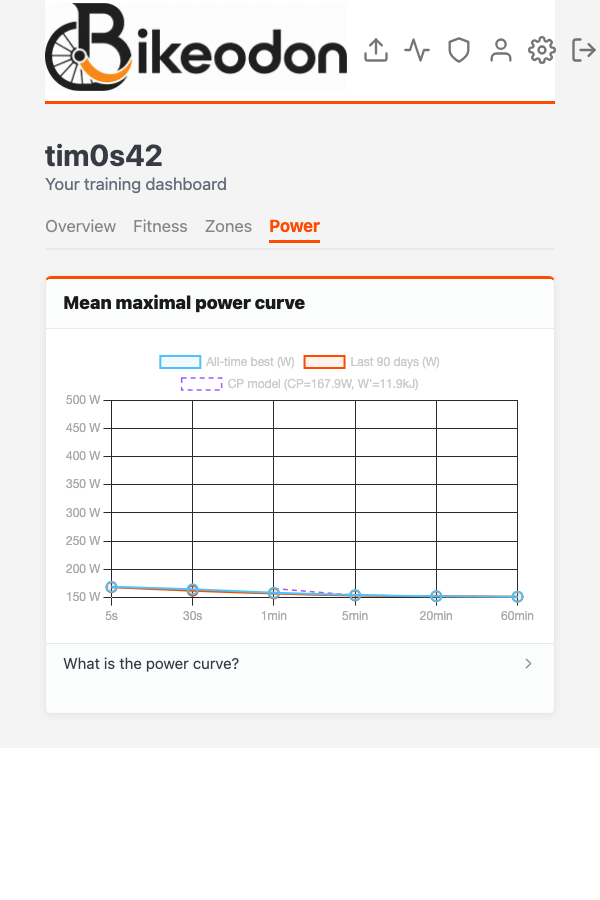
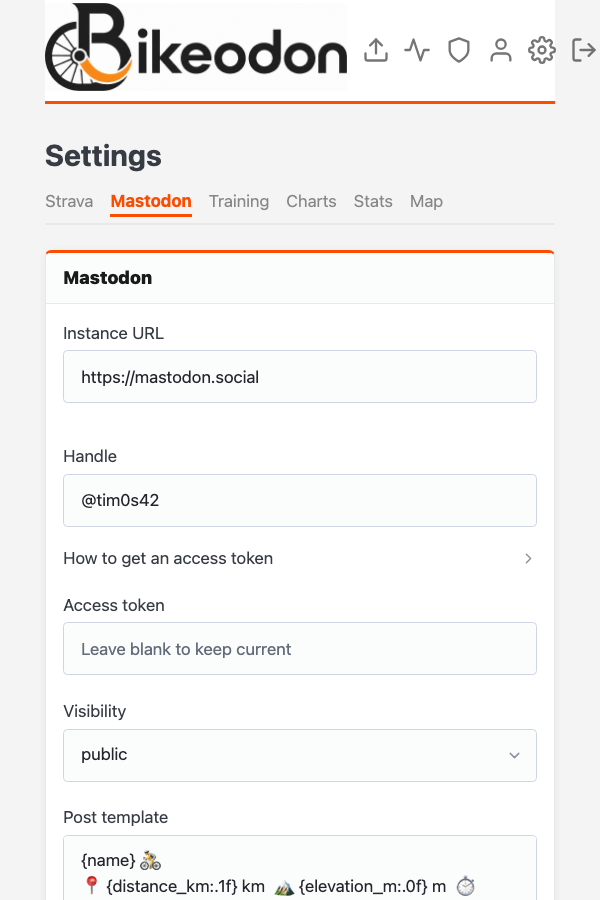

  

**Bikeodon** gets your bike rides onto Mastodon — with a route map, training stats, and HR/power charts — and gives you a private training dashboard built on the same data.

**→ [bikeodon.org](https://bikeodon.org)**

---

## Screenshots

  
   <em>All your rides in one place, with quick stats and post status</em>

  
   <em>Activity detail — route map and HR chart; post to Mastodon in one click</em>

  
   <em>Training dashboard — fitness (CTL), fatigue (ATL), form (TSB), Critical Power, W', and weekly load</em>

  
   <em>Mean maximal power curve with Critical Power model overlay</em>

  
   <em>Auto-detects FTP and max HR from your data — or set them manually</em>

---

## What you get

**For every activity you post**, Bikeodon generates:

- **A route map** — GPS track rendered on OpenStreetMap tiles, with a stats overlay
- **Heart rate zones chart** — time in each zone, coloured by your thresholds
- **Power zones chart** — same for power, if you rode with a power meter

**A private training dashboard** with:

- **Performance Management Chart** — Fitness (CTL), Fatigue (ATL), Form (TSB) over 6 months
- **Mean maximal power curve** — all-time and last 90 days, with Critical Power model overlay
- **W' balance** — per-activity chart of anaerobic reserve depletion and recovery (Skiba 2012)
- **Zone distribution** — total time in each HR and power zone across all activities
- **Critical Power and W'** — fitted from your own MMP curve, no lab test needed

Everything is customisable: map tiles, colours, stats bar fields, post text template, zone definitions.

## Getting your activities in

Upload **GPX, TCX, or FIT files** directly — works with Zwift, TrainerRoad, Wahoo ELEMNT, Garmin Connect, Polar, and any platform that exports standard activity files.

Connect **Strava** and new activities appear automatically via webhook — no manual steps needed.

## How to post

1. Connect your Mastodon account in Settings
2. Bring in activities via file upload or Strava sync
3. Click **Post to Mastodon** on any activity

## Self-hosting

Bikeodon is open source and designed to be self-hosted. See [DEPLOY.md](DEPLOY.md) for full instructions (Oracle Cloud free tier, nginx, gunicorn — all covered).

## License

BSD 3-Clause. See [LICENSE](LICENSE).
